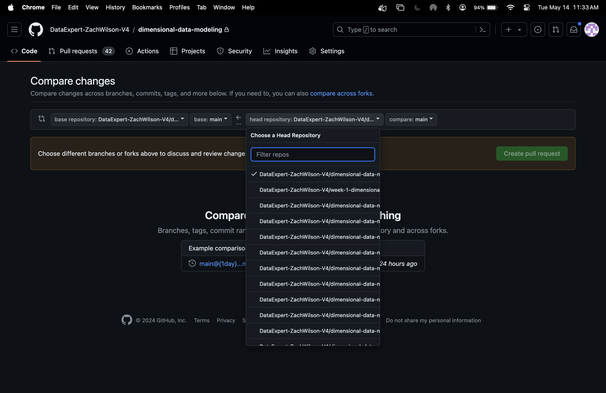

# Dimensional Data Modeling

## Submission Guidelines

Due to our use of GitHub Classroom automation, we cannot accommodate individual requests for changes, so please read through all instructions carefully.

1. **Complete assignment prompts:** Write your SQL in the query file corresponding to the prompt number in the **`submission`** folder. Do not change the file names!
    >
    > :warning: Please note that the `_app` folder, `Dockerfile`, and `.github` folder are essential components that facilitate automatic tests and feedback generation. 
    > To ensure smooth operation of these processes, **please refrain from making any changes to these files/folders**. 
    > Your focus should solely remain on editing files within the **`submission`** folder.
    >

2. **Lint your SQL code for readability.** This ensures your code is easy to follow and understand.

3. **Add comments to your queries.** Use the **`--`** syntax to explain each step and help the reviewer understand your thought process. 

4. **Submit your work:**
    - Open a Pull Request (PR) to merge changes from your **`homework`** branch in your forked repository into the **`main`** branch in the upstream/base repository. In other words:
      - The base repository should be **`DataExpert-ZachWilson-V4/dimensional-data-modeling:main`**
      - The head repository should be **`DataExpert-ZachWilson-V4/dimensional-data-modeling-<your_github_username>:<your_homework_branch>`**
    - This action will trigger the GitHub workflow, assuming you've opened the PR in the upstream repository correctly. Please ensure that you are submitting your work to the correct branch and repository, as opening a PR in the wrong location could lead to complications in the review process.
    - See the [Steps to open a PR](#steps-to-open-a-pr) section below if you need help with this.

  5. A link to your PR will be automatically shared with our TA team for review. They will begin reviewing everyone's PRs and submitting grades after the homework deadline.

### Steps to open a PR
  1. Go to the upstream [**`dimensional-data-modeling`**](https://github.com/DataExpert-ZachWilson-V4/dimensional-data-modeling) repository
  2. Click the [**Pull Requests**](https://github.com/DataExpert-ZachWilson-V4/dimensional-data-modeling/pulls) tab
  3. Click the **"New pull request"** button on the top-right. Now you should be on the [**"Compare changes"**](https://github.com/DataExpert-ZachWilson-V4/dimensional-data-modeling/compare) page
  4. Click where it says **"compare across forks"**
  5. Leave the base repository as is. For the **"head repository"**, select your forked repository and then the name of the branch you want to compare:
     - 
  6. Click the **"Create pull request"** button to open the PR

### Grading
  - Grades are pass or fail, used solely for certification.
  - Changes made after the deadline won't be considered. 
  - An approved PR means a Pass grade. If changes are requested, the grade will be marked as Fail.
  - The reviewer may provide comments or suggestions when they request changes, but they're optional and won't be reviewed.
  - Only one (human) review will be provided for grading after the deadline.

**:warning: :exclamation: IMPORTANT CONSIDERATIONS & REMINDERS :exclamation: :warning:**
  - Your final submission must be on one branch. 
  - You can revise and push changes to the PR any time before the deadline.
  - Some assignments may include tests or feedback generated by the GitHub Action, which you may use to revise your solutions before the deadline.
  - Only open one PR in the **`main`** branch of the upstream repo for your submission. The first PR you open will be considered your final submission.
  - Enhance your review by helping your reviewer. Add comments under 'Files changed' to summarize or highlight key parts of your code. If you've already added comments throughout your code as recommended, then you can simply reiterate or summarize those comments in this section.
  - Avoid further changes after the deadline. They won't be reviewed, and committing changes after the deadline can cause confusion and delay the review process.

Assignment
==================

ℹ️ **PLEASE NOTE**: You should **not** include any schema names in your SQL queries for this assignment.

## Dataset Overview

This assignment involves working with the **`actor_films`** dataset. Your task is to construct a series of SQL queries and table definitions that will allow us to model the **`actor_films`** dataset in a way that facilitates efficient analysis. This involves creating new tables, defining data types, and writing queries to populate these tables with data from the **`actor_films`** dataset.

The `actor_films` dataset contains the following fields:

- `actor`: The name of the actor.
- `actor_id`: A unique identifier for each actor.
- `film`: The name of the film.
- `year`: The year the film was released.
- `votes`: The number of votes the film received.
- `rating`: The rating of the film.
- `film_id`: A unique identifier for each film.

The primary key for this dataset is (`actor_id`, `film_id`).

## Assignment Tasks

### Actors Table DDL (query_1)

Write a DDL query to create an `actors` table with the following fields:

- `actor`: Actor name
- `actor_id`: Actor's ID
- `films`: An array of `struct` with the following fields:
  - `film`: The name of the film.
  - `votes`: The number of votes the film received.
  - `rating`: The rating of the film.
  - `film_id`: A unique identifier for each film.
- `quality_class`: A categorical bucketing of the average rating of the movies for this actor in their most recent year:
  - `star`: Average rating > 8.
  - `good`: Average rating > 7 and ≤ 8.
  - `average`: Average rating > 6 and ≤ 7.
  - `bad`: Average rating ≤ 6.
- `is_active`: A BOOLEAN field that indicates whether an actor is currently active in the film industry (i.e., making films this year).
- `current_year`: The year this row represents for the actor

### Cumulative Table Computation Query (query_2)

Write a query that populates the `actors` table one year at a time.

### Actors History SCD Table DDL (query_3)

Write a DDL statement to create an `actors_history_scd` table that tracks the following fields for each actor in the `actors` table:

- `quality_class`
- `is_active`
- `start_date`
- `end_date`

Note that this table should be appropriately modeled as a Type 2 Slowly Changing Dimension Table (`start_date` and `end_date`).

### Actors History SCD Table Batch Backfill Query (query_4)

Write a "backfill" query that can populate the entire `actors_history_scd` table in a single query.

### Actors History SCD Table Incremental Backfill Query (query_5)

Write an "incremental" query that can populate a single year's worth of the `actors_history_scd` table by combining the previous year's SCD data with the new incoming data from the `actors` table for this year.
